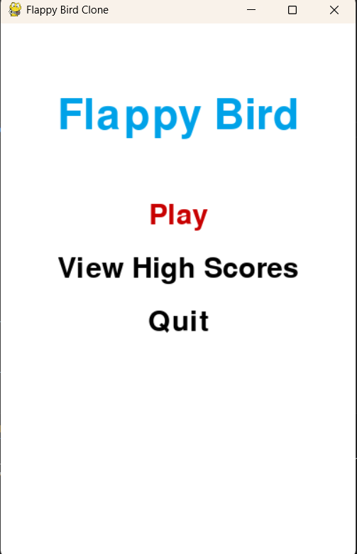
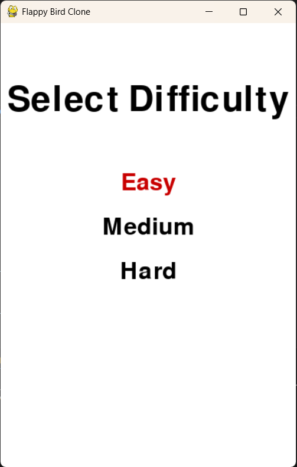
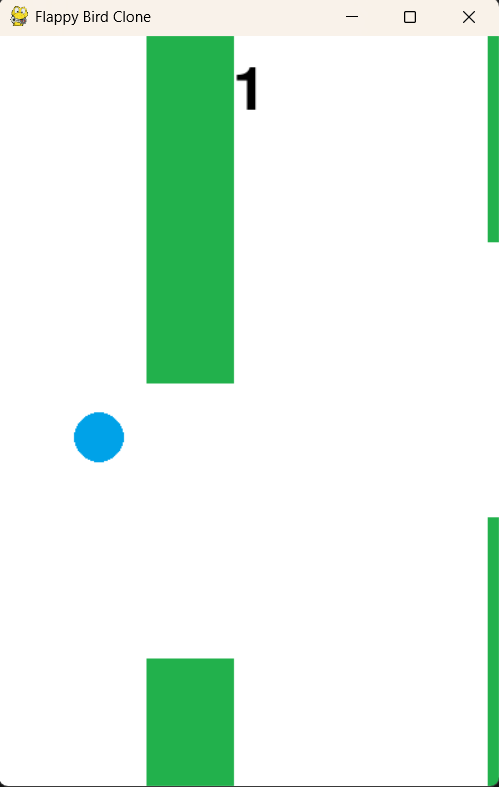
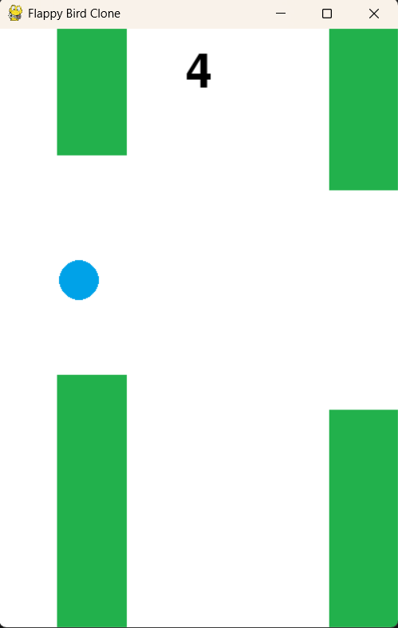
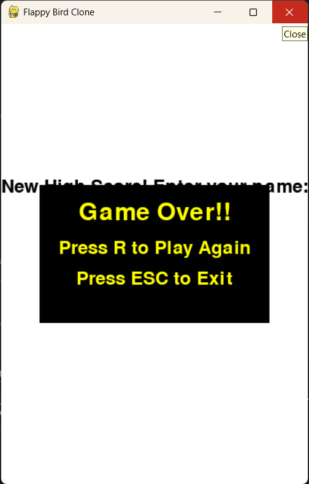
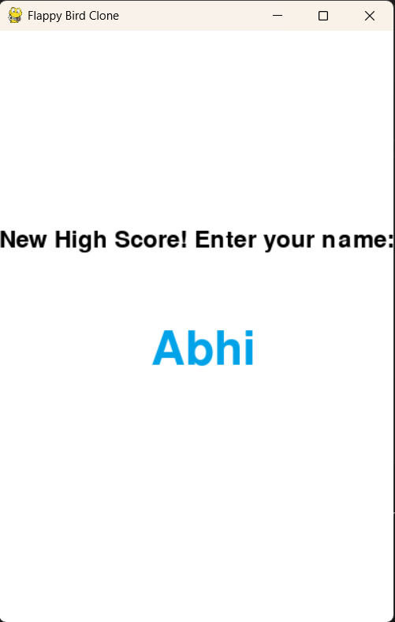
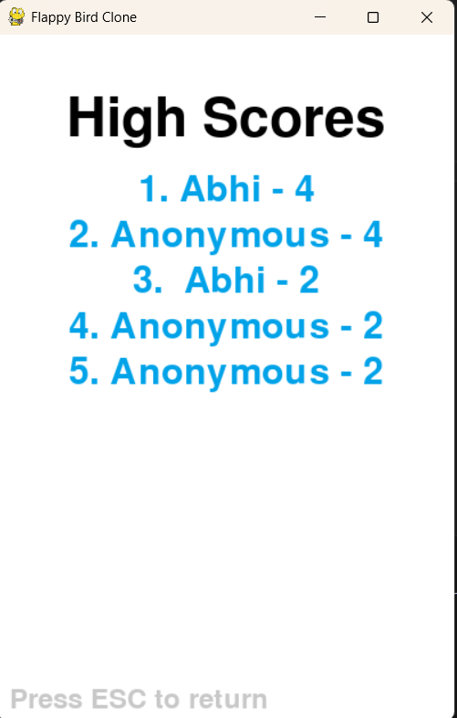

# Prompt Experiment 03: Flappy Bird Clone in Python

**Project Name**: `flappy_bird`  
**Final Code File**: `main.py`  
**Language & Framework**: Python using `pygame`  
**Objective**: Create a fully playable Flappy Bird clone using prompt engineering only—no manual coding.  
**GitHub Repository**: [Access the complete version of game](https://github.com/Mr-AbhiJoshi/prompt-experiments/tree/main/flappy-bird)

---

## 🧠 Initial Prompt Strategy

This project stands out due to the precision and completeness of the initial prompt. The first message to ChatGPT was highly detailed and specific, outlining gameplay mechanics, user interface expectations, audio handling, difficulty levels, modular function structure, and even error handling. As a result, the first working version of the game was almost complete, requiring just **one follow-up prompt** for refinement.

---

## 🚀 Features Implemented

- **Dynamic Gameplay Mechanics**  
  Realistic gravity and flapping mechanics with progressively challenging pipe gaps.

- **Main Menu System**  
  Visually centered menu with options: Play, View High Scores, and Quit.

- **Difficulty Levels**  
  Three selectable levels: Easy (slower gameplay, wider gaps), Medium, and Hard (default).

- **Modular Code Structure**  
  Functions such as `main_menu()`, `game_loop()`, `draw_bird()`, `check_collision()`, `pause_game()` etc. implemented cleanly.

- **In-Game High Score Recording**  
  Top 5 scores saved to a local `highscores.json`. If a new high score is achieved, the user is prompted (in-game) for their name.

- **Audio Integration**  
  Background music, flap sound, and collision effects handled gracefully with fallbacks if assets are missing.

- **Pause and Resume Feature**  
  Press 'P' anytime to pause or resume the game.

- **Styled Game Over Screen**  
  Displays a "Game Over!!" message inside a styled rectangle, with replay and exit instructions clearly visible.

---

## 🔁 Iterative Enhancements

### 1. Difficulty Selection Logic
**Prompt**:  
> "When the player hits 'Play' on the main menu, ask for Easy, Medium and Hard difficulty. The current version should be Hard. Medium: wider pipe gap. Easy: wider gap + slower bird."

**Resolution**:  
Game was enhanced to allow users to choose a difficulty level directly from the UI before gameplay begins. Pipe spacing and bird velocity dynamically adjust based on selection.

---

### 2. Styled Game Over UI
**Prompt**:  
> "When the player hits a pipe, display 'Game Over!!' with two options inside a black rectangle: Press R to Play Again and Press ESC to Exit."

**Resolution**:  
ChatGPT modified the Game Over screen with black background rectangles and yellow instruction text, significantly improving visual clarity and professionalism.

---

## 🖼️ Visuals and Code Repository

### 📸 Game Snapshots

- **Main Menu**

- **Difficulty Selection Screen**

- **Gameplay in Action**

- **Game Over Screen**

- **High Score Entry Prompt**

- **High Score Table**

---

### 🔗 ChatGPT Conversation Log  
[Click to view full prompt engineering session](https://chatgpt.com/share/681ec1c6-384c-8013-88e8-fb32d4e557d8)

### 📂 Repository Contents

- `main.py` – Main game script  
- `assets/` – Folder for game assets
- `flappy_bird.md` – This detailed documentation
- `flappy_bird_prompt.txt` - A curated prompt for creating your own tic-tac-toe game
- `screenshots/` - Original screenshots from the game

---

## 🧪 Learnings and Reflections

- **Prompt Specificity Leads to Better Code**  
  A well-structured initial prompt reduced the need for corrections and refinements.

- **Modular Planning Pays Off**  
  Specifying modular functions in the prompt helped produce clean, maintainable code from the outset.

- **Efficient Iteration**  
  Only one follow-up was required to polish visuals and difficulty handling, showcasing ChatGPT's capacity when guided precisely.

- **UI-Driven Development**  
  ChatGPT was able to implement clean UI logic based on purely textual instructions with minimal iterations.

- **Graceful Fallbacks**  
  Audio and file handling were designed to fail silently if files were missing, demonstrating robust error-tolerant coding practices.

---

## 📌 Conclusion

This project exemplifies how a **deeply thought-out initial prompt** can significantly reduce development cycles when using AI for code generation. The Flappy Bird clone achieved functional and visual polish quickly, thanks to the level of detail provided in the very first message.

It’s a strong case study for anyone interested in **prompt-based software development workflows**.

---

## 🙏 Credits

> Built entirely through **prompt engineering** using **ChatGPT**.  
> No manual coding was done during the development process.

---
