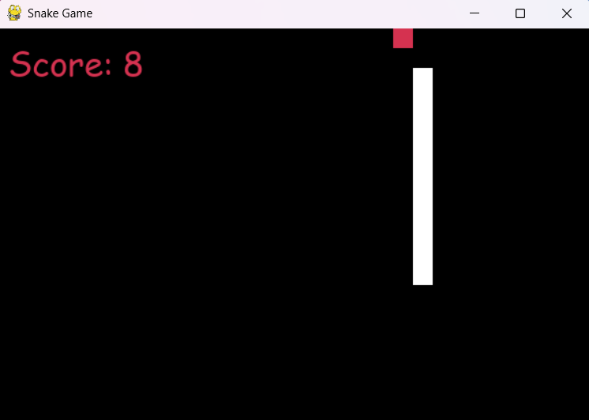

# 🐍 Snake Game Using Prompt Engineering

## 🎯 Problem Statement
I wanted to create a simple Snake game in Python using only natural language prompts, without writing any code manually. The goal was to test how effectively an LLM like ChatGPT (GPT-4) could generate functional game logic, handle bugs, and make enhancements through iterative prompting.

## 🤖 Model & Environment
- Model: ChatGPT (GPT-4)
- Interface: ChatGPT Web UI
- Prompt Style: Iterative, Chain of Thought, Role-based
- Language: Python 3 with Pygame
- No manual coding – all code was generated and debugged using GPT

## 🧪 Experiment Overview
The development process was conducted through a series of prompts and responses with ChatGPT. The goal was to iteratively build and refine the Snake game by providing natural language instructions and addressing issues as they arose.

## 🧠 Initial Prompt
I'm planning to create a snake game in python. Would you please elaborate the plan for doing so, with all the necessary steps ?

### ChatGPT Response: 
Provided a foundational code structure for the Snake game, including game loop, snake movement, food generation, and score tracking.

## 🔁 Iterative Enhancements

### a. Dynamic Playing Field
**Issue:** The game window was of fixed size, limiting player flexibility.

**Prompt:** "I would like you to make the size of playing field dynamic, so that the player can stretch or shrink the playing window accordingly."

**Resolution:** ChatGPT modified the window initialization logic to accept user-defined dimensions, allowing players to customize the game screen size through in-game input or configuration.

---

### b. Main Menu and Theme Selection
**Issue:** Lack of a main menu and limited visual customization made the game feel basic.

**Prompt:** "Create a main menu as well. Also, I would like you to create a themes section, having 3 selectable themes, in which the background color and the snake color should be contrasting..."

**Resolution:** A main menu interface was implemented with navigable options. A themes screen was introduced with three distinct, high-contrast theme presets, enhancing accessibility and game aesthetics.

---

### c. Pause and Resume Functionality
**Issue:** The game lacked the ability to pause and resume mid-play.

**Prompt:** "Can you give me the code for the pause/resume feature and tell me where to place it, so you don't have to rewrite the whole code again?"

**Resolution:** ChatGPT provided a modular pause/resume implementation. Clear integration instructions were included to insert the feature into the game loop with minimal disruption.

---

### d. Integrated In-Game Input & Theme Previews
**Issue:** Difficulty was selected via console input, and theme previews were not visible during selection.

**Prompt:** "I need [difficulty] to be asked in the game itself... Also, can we display what the different themes look like in the theme selection screen...?"

**Resolution:** Difficulty selection was moved to a graphical interface within the game. The theme selection screen was enhanced with live previews of each theme, improving usability and player decision-making.

---

### e. Local Variable Reference Bug
**Issue:** Game crashed on start due to `UnboundLocalError` referencing an undefined `window` variable.

**Prompt:** *Reported full traceback error.*

**Resolution:** ChatGPT reviewed the game structure and identified a scoping issue. The `window` variable was restructured to be properly defined and passed to all dependent functions.

---

### f. High Score System + Background Music + Snake Length
**Issue:** No persistent high score system, silent gameplay, and a snake that started too short.

**Prompt:** "Add a high score keeping mechanism... keep only last 5 highscores... Add background music... Increase initial snake length to at least 3 tiles."

**Resolution:** A named-entry high score table was implemented, storing separate top 5 scores for each difficulty. A music track was added for background play, and the snake's starting length was increased to 3 segments.

---

### g. High Score Name Input Bug
**Issue:** After game over, entering a name for high score would not proceed and got stuck in input.

**Prompt:** "I would like it to register the user name, and then pop up the replay or quit screen."

**Resolution:** Input handling logic was debugged and corrected to ensure the name entry properly finalized and redirected to the end screen as intended.

---

### h. Multiple Name Entry Loops
**Issue:** Game repeatedly asked for the player's name 5 times upon high score entry.

**Prompt:** "Actually what is happening is, the highscore keeps asking the player's name 5 times..."

**Resolution:** ChatGPT identified that the loop logic for updating five high score slots was mistakenly triggering input multiple times. This was corrected to request the name only once.

---

### i. High Score Table Viewer
**Issue:** Players had no way to view the current high scores from the main menu.

**Prompt:** "Can you enter a highscore table viewing functionality in the main menu?"

**Resolution:** A new menu option was added to display a high score table, segmented by difficulty level, allowing players to view top scores directly from the main interface.

---

### j. Visual Overhaul of Main Menu
**Issue:** The main menu layout was cramped and visually unappealing.

**Prompt:** "The main menu looks very boring and cramped. I need you to implement good visuals for the main menu..."

**Resolution:** The menu UI was redesigned with improved spacing, modern typography, and better visual hierarchy. Option elements were visually separated and styled to improve clarity and polish.

---

## ✅ Final Features

The completed Snake game includes a rich set of features implemented entirely through AI-driven development using prompt engineering. Here’s a comprehensive summary:

### 🐍 Dynamic Snake Growth
The snake intelligently grows longer with every piece of food consumed, making gameplay progressively more challenging and engaging.

### 📈 Real-Time Score Tracking
A live scoreboard is displayed on-screen throughout gameplay, updating the player's score based on the number of food items collected.

### 🎮 Difficulty Selection
Players can choose their desired difficulty level—Easy, Medium, or Hard—directly within the game UI. Each level adjusts the snake's speed and response time for varied gameplay experiences.

### 🧭 Interactive Main Menu
The game starts with a visually enhanced main menu offering intuitive navigation:
- **Start Game**
- **Theme Selection**
- **View High Scores**
- **Quit**

### 🎨 Thematic Customization
Three contrasting visual themes are available, each with distinctive background and snake colors. Players can preview these themes before making a selection, improving accessibility and immersion.

### 🔁 Pause & Resume
Gameplay can be paused and resumed seamlessly, enabling a smoother experience and giving players more control.

### 🎵 Background Music
The game includes continuous background music to elevate the atmosphere, creating a more enjoyable and polished gaming session.

### 🏆 High Score Management
- High scores are recorded separately for each difficulty level.
- Only the top 5 scores are retained per level.
- Players are prompted to enter their name in-game upon breaking a high score.

### 📋 High Score Viewer
A dedicated menu option allows players to view the leaderboard directly from the main interface, segmented by difficulty.

### 🔄 Game Over + Replay Functionality
Upon losing, players are presented with a clean replay or quit screen. High score entry is smooth and correctly handled before transitioning.

---

## 🖼️ Visuals and Code Repository

### 📸 Game Snapshots

- **Main Menu**

- **Theme Selection Screen**

- **Difficulty Selection Screen**

- **Gameplay in Action**

- **Game Over Screen**

- **High Score Entry Prompt**

- **High Score Table**

---

### 💾 Final Code Repository

The complete and final version of the Snake game is available here:

🔗 **GitHub Repository:** [Mr-AbhiJoshi/prompt-experiments](https://github.com/Mr-AbhiJoshi/prompt-experiments)

- `main.py` – Main game script  
- `assets/` – Folder for images, fonts, and music  
- `snake_game.md` – This detailed documentation
- `snake_game_prompt.docx` - A curated prompt for creating your own snake game
- `screenshots` - Original screenshots from the game

---

### 💬 ChatGPT Prompt Log

The entire iterative conversation with ChatGPT, including prompts, code generation, and debugging exchanges, can be viewed here:

🔗 **ChatGPT Conversation Link:** [Creating Snake Game with ChatGPT](https://chatgpt.com/share/681de2a6-aa3c-800b-a129-ff7b64cee911)

This log provides full transparency into the prompt-driven development process and serves as a powerful demonstration of AI-assisted software creation.

---

## 📚 Learnings and Reflections

Throughout this experiment, several key insights and takeaways emerged that demonstrate the effectiveness of using AI in development workflows:

### 🔍 Prompt Specificity
The clearer and more detailed the prompt, the more precise and effective ChatGPT's responses were. Specificity reduced the number of iterations required to achieve a desired result.

### 🔄 Iterative Development
Working with ChatGPT mimicked a real-time pair-programming session. Iteratively refining prompts and addressing issues led to steady progress and high-quality results.

### 🤖 Understanding AI Capabilities
ChatGPT proved capable of handling non-trivial game logic such as real-time input handling, score tracking, error resolution, and UI/UX enhancements—provided the instructions were well-structured.

### 🗂️ Importance of Documentation
Maintaining a record of prompts, issues, and resolutions was essential for clarity, debugging, and future replication. The structured documentation here reflects how AI can be incorporated into real-world development practices effectively.

### 🎯 Mindset Shift
Rather than thinking in terms of syntax and code, this experiment encouraged a mindset shift toward system design, behavior specification, and user experience thinking—guided entirely through natural language.

---

## 🧾 Conclusion

This experiment represents a successful use of prompt engineering to create a full-featured, playable game using Python and Pygame—with **zero manual coding**. Each component of the game was developed through structured conversation with ChatGPT, showcasing not only the model’s capability but also how developers can leverage AI for rapid prototyping, debugging, and creative game design.

Going forward, this format will be reused and refined to build other classic games like **Tic-Tac-Toe** and **Flappy Bird**, continuing the exploration of natural language as a primary tool in software development.

---
