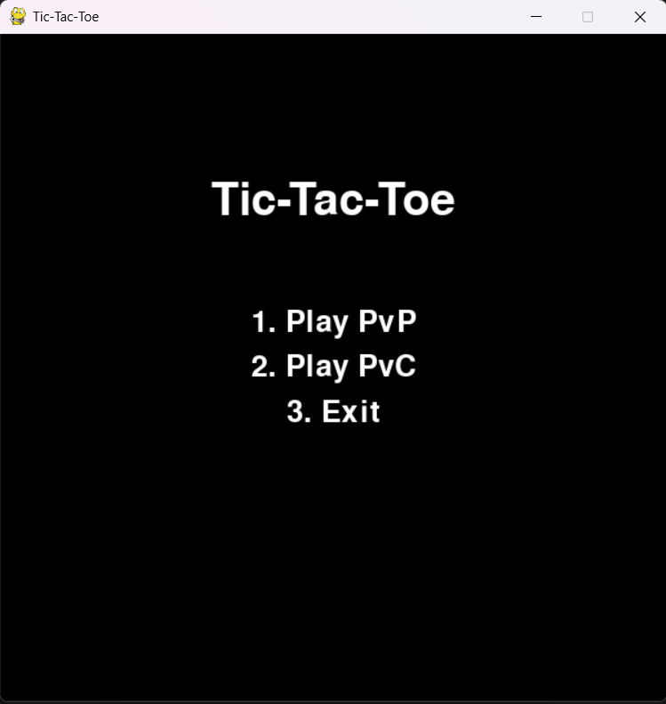
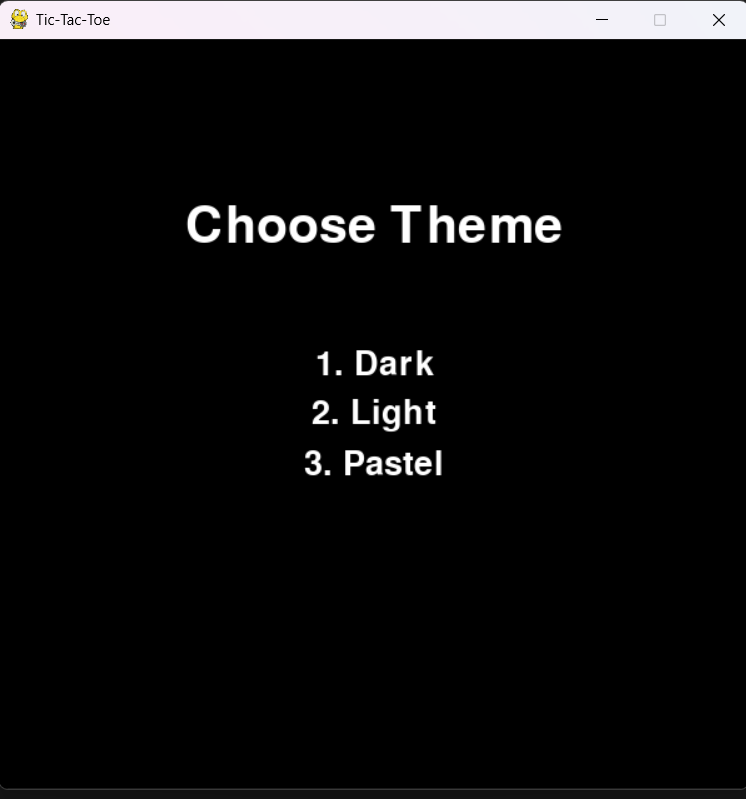
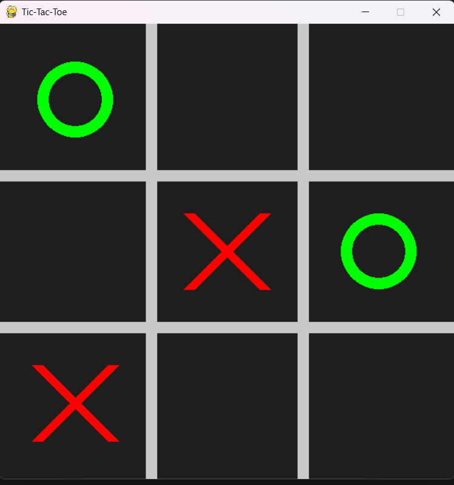
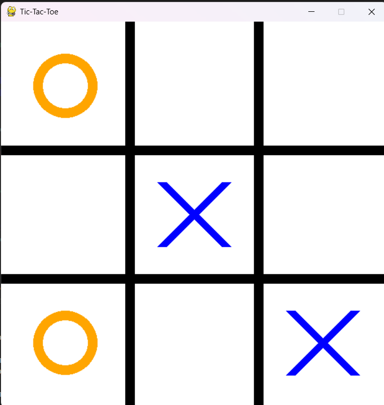
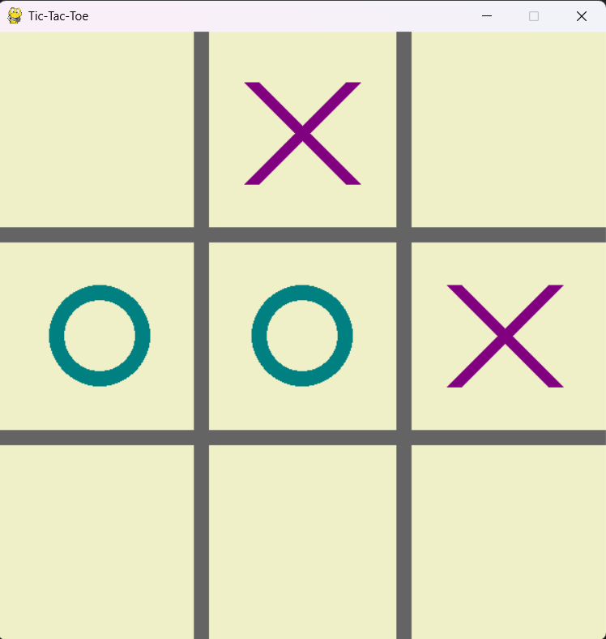
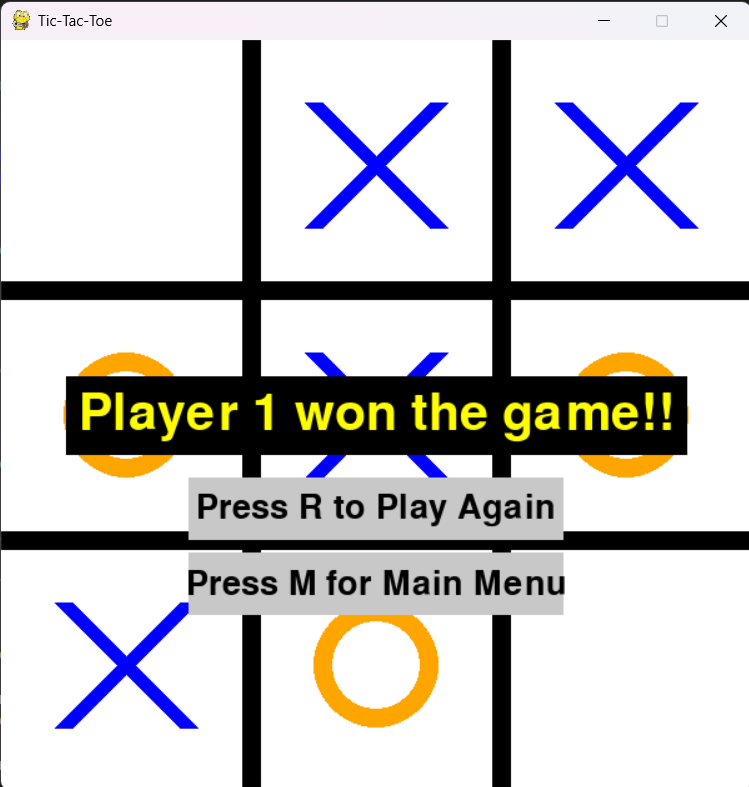
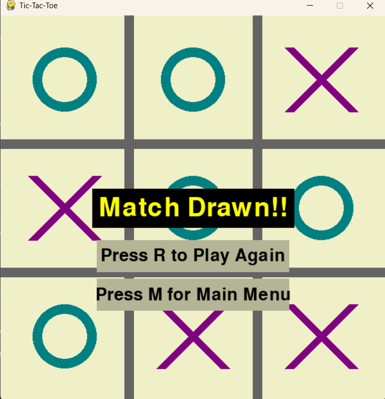

# 🎮 Tic-Tac-Toe in Python (Prompt Engineered with ChatGPT)

This project showcases the development of a complete **Tic-Tac-Toe game in Python**, created entirely through **prompt engineering** using ChatGPT. No manual code was written — instead, iterative dialogue and clear prompting led to a fully functional and visually enhanced game with both PvP and PvC modes.

> 🧠 This project highlights the effectiveness of **detailed initial prompting**, reducing the number of follow-up instructions required and demonstrating ChatGPT's ability to produce high-quality game logic with minimal iteration.

---

## 📝 Prompt Summary

The initial prompt was carefully constructed to encapsulate all desired features, UI/UX considerations, and gameplay logic, resulting in a comprehensive first output from ChatGPT. Here's a summary of the initial requirements:

1. **Main Menu UI** with options:
   - Play PvP (Player vs Player)
   - Play PvC (Player vs Computer)
   - Exit

2. **Theme Selection**: Players select from 3 visually distinct themes with contrasting background, grid, and symbol colors.

3. **Player Modes**:
   - PvP: "Player 1" vs "Player 2" with randomly assigned X or O symbols.
   - PvC: "Player" vs "Computer" with assigned symbols and basic AI.

4. **Game Result Display**:
   - Win detection and correct attribution (e.g., "Player 1 won the game!!")
   - Option to **Play Again** or **Return to Main Menu**

5. **Audio Integration**: Background music enhances the overall experience.

6. **Polished UX**:
   - Clear symbol visibility
   - Visual feedback after the game ends

> ✅ Initial ChatGPT response: "Understood. No further questions."  
> ⏳ Iteration effort was significantly reduced due to the prompt's completeness.

---

## 🔄 Iterative Enhancements

Although the base game was largely complete after the first prompt, a few improvements were made through targeted follow-ups.

### 1. Fixing Win Detection Logic  
**Issue**: Incorrect win declaration (e.g., declaring a winner when it's a draw).  
**Prompt**: "The game's winning logic is flawed. Please learn how TicTacToe is played and then redefine the game's logic."  
**Resolution**: Updated game logic to accurately detect winning patterns and avoid false positives.

---

### 2. Improved Endgame UI  
**Issue**: Endgame options (Play Again / Main Menu) were visually unclear.  
**Prompt**: "Add a solid background with contrasting color to these options so they’re clearly visible."  
**Resolution**: Visual enhancements added with colored background rectangles for better UX.

---

### 3. Realistic PvC Timing  
**Issue**: The computer moved too quickly, making the game feel unnatural.  
**Prompt**: "Add a slight delay before the computer makes its move."  
**Resolution**: A 1-second delay added to simulate thoughtful AI behavior.

---

### 4. Match Draw Logic  
**Issue**: Games with no winners were incorrectly ending as a win.  
**Prompt**: "Add a 'Match Drawn' result when no winner is found."  
**Resolution**: Logic adjusted to correctly detect full board without winner and display a draw message.

---

### 5. Smarter AI  
**Issue**: The computer opponent was too easy to beat.  
**Prompt**: "Introduce random intelligence so the AI occasionally plays optimally."  
**Resolution**: Randomized decision-making patterns introduced to increase challenge.

---

### 6. Delay Bug in PvC  
**Issue**: Delay occurred after player move, not before computer move.  
**Prompt**: "Move the delay to occur before the computer plays its move, not after the player."  
**Resolution**: Bug resolved; gameplay now flows naturally.

---

### 7. Enhanced Winner Display  
**Issue**: The winner message lacked visual emphasis.  
**Prompt**: "Add a black background rectangle behind the yellow winner text."  
**Resolution**: Visual improvement made for better readability and game polish.

---

## ✅ Final Features

- 🎮 **Game Modes**: Play against another player or an AI opponent.
- 🎨 **Theme Selector**: Choose from 3 color-contrasted themes for improved visuals.
- 🧠 **Smart AI**: Computer uses a mix of randomness and logic to create challenge.
- 🔁 **Replay or Exit**: Option to restart the game or return to the main menu post-match.
- 🎵 **Background Music**: Audio loop integrated to elevate player immersion.
- 🖼️ **Responsive UI**: Endgame text and menu buttons are visually distinct and user-friendly.

---

## 💡 Learnings and Reflections

- **Prompt Specificity**: A detailed first prompt minimized ambiguity and resulted in better first outputs.
- **AI as a Dev Partner**: ChatGPT effectively responded to structured feedback to iteratively refine gameplay.
- **Debugging via Dialogue**: Bugs and design issues were quickly resolved through conversational debugging.
- **Importance of UI**: UX-focused prompts helped generate visuals that enhanced the game’s professionalism.
- **Template Reusability**: This markdown format and prompt structure will be reused across future projects.

---

## 🖼️ Visuals and Code Repository

### 📸 Game Snapshots

- **Main Menu**

- **Theme Selection Screen**

- **Gameplay in Action**

- **Game Over Screen**

---

### 🔗 ChatGPT Conversation Log  
[Click to view full prompt engineering session](https://chat.openai.com/share/681ec1cb-615c-8013-bf8e-d906095426ba)

### 📂 Repository Contents

- `main.py` – Main game script  
- `assets/` – Folder for game assets
- `tic-tac-toe.md` – This detailed documentation
- `tic-tac-toe_prompt.txt` - A curated prompt for creating your own tic-tac-toe game
- `screenshots/` - Original screenshots from the game